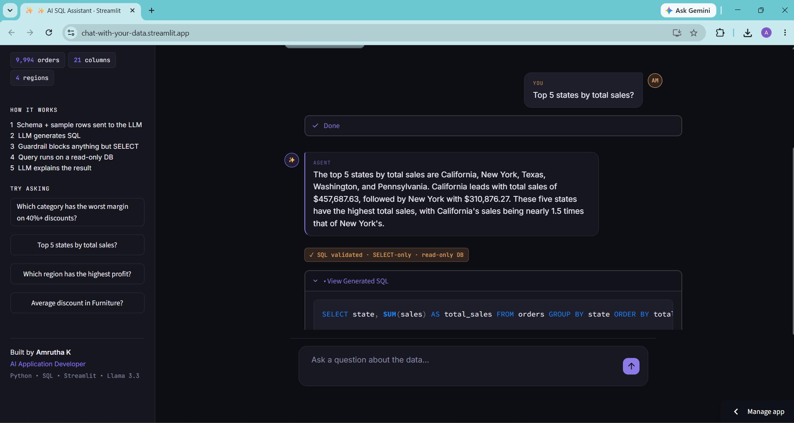

# AI SQL Assistant

**Ask a database questions in plain English — get a real, grounded answer back.**

An AI agent that reads a SQLite database's schema, writes SQL to answer your question, validates it through a code-level safety guardrail, runs it read-only, and explains the result in plain language. Built to demonstrate a full, safe LLM-agent pipeline — not just a wrapper around a chat API.

🔗 **Live demo:** [ai-sql-assistant.streamlit.app](https://chat-with-your-data.streamlit.app/) 




---

## Why this exists

Most "chat with your data" demos either hardcode the schema (breaks the moment your data changes) or trust the LLM to run whatever SQL it generates (a real security risk). This project does neither:

- **Schema-aware, not hardcoded** — the agent introspects the actual database at runtime (`PRAGMA table_info`), so it adapts to any table structure without code changes.
- **Two independent safety layers** — a code-level guardrail rejects anything that isn't a single `SELECT` statement *before* it ever reaches the database, and the database connection itself is opened read-only (`mode=ro`) as a second, independent line of defense.
- **Conversational memory** — follow-up questions like *"what about the West region?"* resolve correctly using the last few turns of context.

## How it works

```
Your question
     │
     ▼
1. Read schema     — introspect the SQLite database directly
2. Generate SQL    — LLM (Llama 3.3 70B via Groq) writes a single SELECT
3. Validate         — code-level guardrail: SELECT-only, no forbidden keywords, single statement
4. Execute          — read-only SQLite connection (mode=ro)
5. Explain          — LLM translates the result into a plain-English answer
     │
     ▼
Your answer, with the SQL and guardrail check shown alongside it
```

## Features

- 💬 Chat interface with a live pipeline trail — you watch each step happen in real time
- 🛡️ Two-layer SQL safety guardrail (code-level validation + read-only DB connection)
- 🧠 Conversation memory for natural follow-up questions
- 🔍 Every answer shows its generated SQL and a "validated" badge, so nothing is a black box
- 🎨 Custom dark UI (Llama/Groq stack, not a default Streamlit theme)

## Tech stack

`Python` · `Streamlit` · `Groq (Llama 3.3 70B)` · `SQLite` · `pandas`

## Try it yourself

The live demo runs on the classic Superstore retail dataset (9,994 orders). Example questions:

- *"Which product category has the worst average profit margin when discount is 40% or more?"*
- *"Which region has the highest total profit?"*
- *"Top 5 states by total sales?"*
- Follow-up: *"what about the lowest?"*

## Running locally

```bash
git clone https://github.com/Amrutharavindran/ai-sql-assistant.git
cd ai-sql-assistant
pip install -r requirements.txt

# Windows PowerShell — replace with your own key from console.groq.com
$env:GROQ_API_KEY="your-groq-api-key-here"

streamlit run app/app.py
```

Get a free Groq API key at [console.groq.com](https://console.groq.com).
## Deploying your own copy

This app is deployed on [Streamlit Community Cloud](https://share.streamlit.io) (free). To deploy your own:

1. Fork this repo
2. Sign in to share.streamlit.io with GitHub
3. **Create app** → point it at your fork, main file path `app/app.py`
4. In **Settings → Secrets**, add `GROQ_API_KEY = "your-key"`
5. Deploy

## Project structure

```
├── app/
│   └── app.py            # Streamlit chat interface
├── src/
│   ├── sql_agent.py       # Core pipeline: generate → validate → execute → explain
│   └── schema_prompt.py   # Schema introspection + system prompt builder
├── data/
│   └── superstore.db       # SQLite database (Superstore sample dataset)
├── requirements.txt
└── .streamlit/
    └── config.toml         # Dark theme configuration
```

---

Built by **Amrutha K** — [GitHub](https://github.com/Amrutharavindran)
